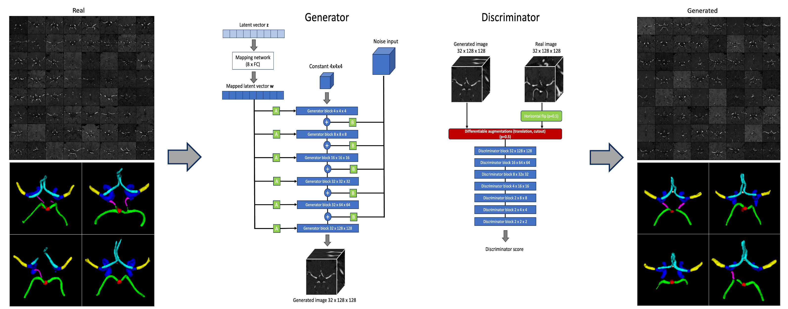

# 3D StyleGAN: Generative Modelling of the Circle of Willis Model Card

Last updated: April 2020

Model card outline as proposed in: [Model Cards for Model Reporting (Mitchell et al.)](https://arxiv.org/abs/1810.03993)

## Model Details
Developed by the Charité Lab for AI in Medicine (CLAIM) research group at Charité University Hospital, Berlin, main developer and person to contact: Orhun Utku Aydin (orhun-utku.aydin@charite.de)

The proposed 3D modification of the StyleGANv2 (original paper: https://arxiv.org/abs/1912.04958 and implementation by https://github.com/lucidrains/stylegan2-pytorch) allows the generation of 3D medical imaging data. The architecture was adapted by replacing all upsampling and convolutional operations to 3D. 
Differentiable augmentations[1] were used for data-efficient training. 

### Model date
April 2024

### Model type
3D Generative Adversarial Network

### Model version
version: v1.0 2024

### Paper and citation
Generative Modeling of the Circle of Willis Using 3D-StyleGAN
Orhun Utku Aydin, Adam Hilbert, Alexander Koch, Felix Lohrke, Jana Rieger, Satoru Tanioka, Dietmar Frey
medRxiv 2024.04.02.24305197;  
doi: https://doi.org/10.1101/2024.04.02.24305197

### License
This project includes software developed by Phil Wang. The original software and associated documentation files (the "Software") are provided under the MIT License. See LICENSE file in the [lucidrains/stylegan2-pytorch repository](https://github.com/lucidrains/stylegan2-pytorch) for the original license terms.

Modifications and additions to the Software were made by CLAIM - Charite Lab for AI in Medicine for the generative modeling of the Circle of Willis from 3D TOF MRA images. The same MIT License applies to this project. 

## Model Use
The primary intended use case is the generative modelling of the variations of the Circle of Willis using 3D TOF-MRA volumes. Synthetic vessel neuroimaging data can be used for various downstream tasks such as 3D classification, vessel segmentation and hemodynamic modelling.  
The code repository can also be used and adapted for the generative modelling of other anatomical landmarks or medical imaging modalities. 
The model is tested with a resolution of 32x128x128 but the image size parameter can be adapted to generate larger or smaller volumes. 

## Factors
Model convergence and performance highly depends on the quality of the presented real TOF MRA volumes (scanners, noise and artifacts in the images), the choice of hyperparameters (especially learning rate and batch size) and usage of differentiable augmentations.

## Data, Performance, and Limitations

### Data 
The training dataset of the model consisted of 6 open source TOF MRA datasets and included 1782 TOF MRA volumes. The datasets primarily included healthy/control patients. The preprocessing included registration to a template and cropping to 32x128x128 size.

The training data originates from multiple centers and various scanners (1.5 T and 3T both old (year:2005) and newer scanners): 
* [IXI Dataset](https://brain-development.org/ixi-dataset/)
* [Lausanne TOF MRA healthy Cohort](https://openneuro.org/datasets/ds003949/versions/1.0.1)
* [Magnetic Resonance Angiography Atlas Dataset (NITRC)](https://www.nitrc.org/frs/?group_id=1113&release_id=3428)
* [CASILab Dataset](https://data.kitware.com/#collection/591086ee8d777f16d01e0724/folder/58a372e38d777f0721a64dc6)
* [ICBM Dataset](https://ida.loni.usc.edu/login.jsp)
* [OASIS 3](https://www.oasis-brains.org/#access)

For downstream multiclass Circle of Willis artery segmentation: 
* [TopCoW Challenge Data](https://topcow23.grand-challenge.org/data/)

### Performance
Detailed results can be found in the [paper](https://doi.org/10.1101/2024.04.02.24305197).
The model performance has been evaluated using quantitative measures:Frechet Inception Distance (FID), MedicalNet[2] Distance (MD) and Area Under the Curve of the Precision and Recall Curve for Distributions (AUC-PRD)[3]. 
The best model configuration achieved an FID of 12.17 MD of 0.00078 and AUC-PRD of 0.9610. This compares to FID of 1.54 MD of 0.00018 and AUC PRD of 0.9890, when the measures are computed between two random subsets of the real training set. 

Qualitative evaluation was performed with a visual Turing test where a board certified stroke specialist classified the presented volumes as either real or generated (accuracy 44 %).

The model was evaluated on the downstream task of multiclass Circle of Willis artery segmentation. 3D nnUnet models trained on purely synthetic data (n=500) showed similar performance to models trained on a smaller set of real data (n=50).

## Limitations
Our 3D StyleGAN adaptation and analysis have several limitations.  
1. Data Diversity and Distribution Coverage: Although the training set is diverse, it is still limited in size (n=1782) and cannot cover the full spectrum of variations present in real-world clinical settings. Our quantitative results indicate a noticeable difference in the distribution of generated volumes compared to the real training data (AUC-PRD: 0.9610). Therefore, especially rare variations of the Circle of Willis might be underrepresented or might be generated with lower quality.    
2. Adaptation to Different Medical Imaging Tasks: While the model can be adapted for the generative modelling of other anatomical landmarks or imaging modalities, the performance might differ since each task and modality might require a different level of diversity and quality from the synthetic images. The potentially limited adaptability could limit the utility of the model across varying medical imaging tasks without extensive hyperparameter tuning or architectural changes. 
3. Image Quality and Scanner Variability: The training dataset comprises images from scanners of different magnetic field strengths and years. While this diversity is a strength in terms of generalizability, it also introduces a limitation. The model might generate synthetic images that reflect the lower quality or specific characteristics (such as artifacts) of older scanner technologies. This discrepancy could impact the utility of the generated data for more recent clinical applications requiring higher resolution and quality data.  
4. Image Registration and ROI selection: The preprocessing steps of image registration and cropping to a specific region-of-interest (ROI) are crucial for directing the generative model's focus to areas of highest clinical relevance. When applied to training data with a broader range of variations, such as pathologies that may manifest across different body or organ locations, these preprocessing techniques may require adjustments. Otherwise, the model's performance could be constrained.

## Ethical Considerations
Generative models are reported to memorize training images and generate copies of the original training data during inference[4]. We employed a replica detection methodology for evaluating the authenticity of the generated data, however we cannot guarantee that our models are privacy preserving, i.e. data leakage in the sense of membership inference attacks cannot be ruled out where individual training data samples are recovered from our trained model. 
Therefore, we make only the code publicly available whereas our model weights will be made available upon reasonable request with assurance that the applying researcher has gained access to all the open access training datasets used in this study. This should let researchers reproduce our results and generate very similar synthetic datasets.

-------
## References

 <a name="fn1">[1]</a> Zhao, Shengyu, Zhijian Liu, Ji Lin, Jun-Yan Zhu, and Song Han. “Differentiable Augmentation for Data-Efficient GAN Training.” arXiv, December 7, 2020. http://arxiv.org/abs/2006.10738.
 
 <a name="fn2">[2]</a> Chen, Sihong, Kai Ma, and Yefeng Zheng. “Med3D: Transfer Learning for 3D Medical Image Analysis.” arXiv, July 17, 2019. https://doi.org/10.48550/arXiv.1904.00625.
 
 <a name="fn3">[3]</a> Sajjadi, Mehdi S. M., Olivier Bachem, Mario Lucic, Olivier Bousquet, and Sylvain Gelly. “Assessing Generative Models via Precision and Recall.” In Advances in Neural Information Processing Systems, Vol. 31. Curran Associates, Inc., 2018. https://proceedings.neurips.cc/paper_files/paper/2018/hash/f7696a9b362ac5a51c3dc8f098b73923-Abstract.html.

 <a name="fn3">[4]</a> Dar, Salman Ul Hassan, Arman Ghanaat, Jannik Kahmann, Isabelle Ayx, Theano Papavassiliu, Stefan O. Schoenberg, and Sandy Engelhardt. “Investigating Data Memorization in 3D Latent Diffusion Models for Medical Image Synthesis.” In Deep Generative Models, edited by Anirban Mukhopadhyay, Ilkay Oksuz, Sandy Engelhardt, Dajiang Zhu, and Yixuan Yuan, 56–65. Cham: Springer Nature Switzerland, 2024. https://doi.org/10.1007/978-3-031-53767-7_6.

